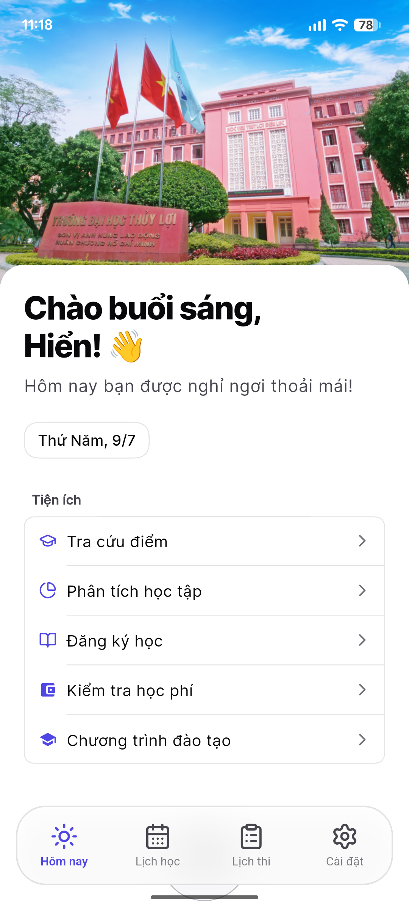
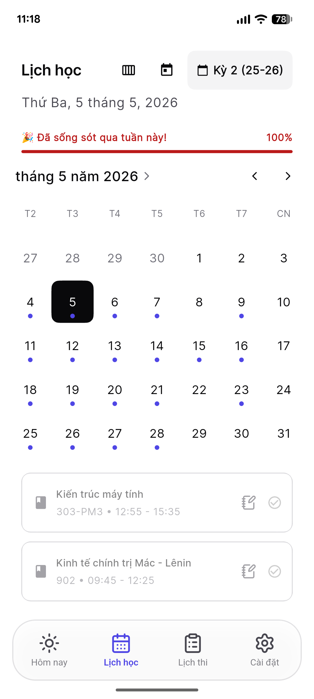
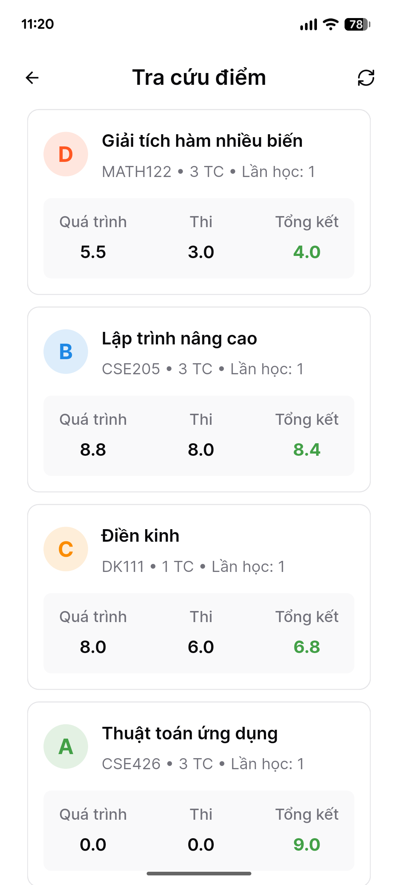
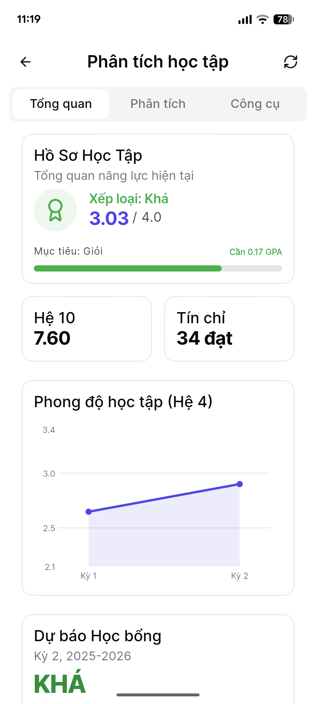
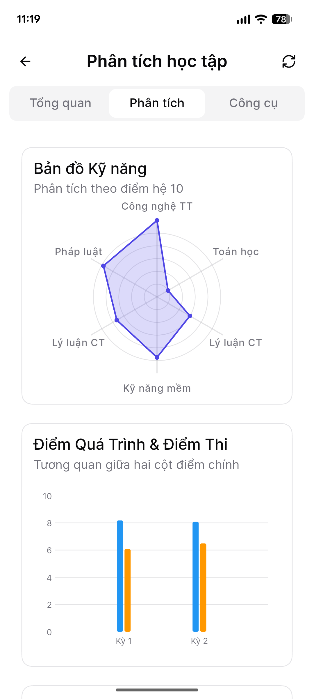
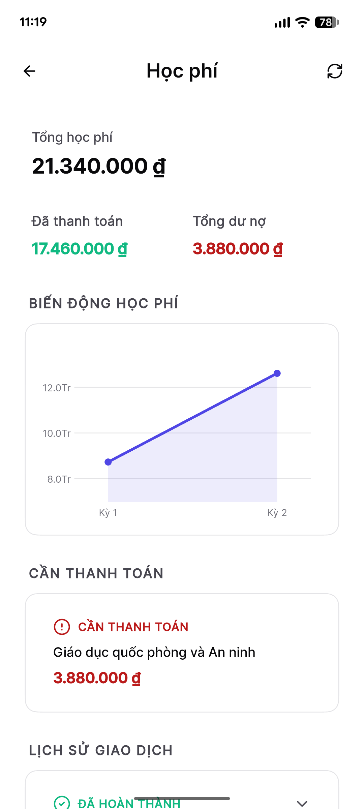
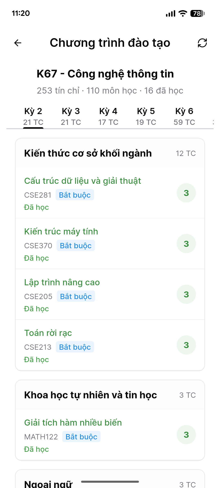

<div align="center">


# TLU Calendar

**Ứng dụng mã nguồn mở giúp sinh viên Đại học Thủy Lợi theo dõi lịch học, lịch thi và quá trình học tập.**

<br />

[](https://flutter.dev)
[](https://github.com/Miho1254/my-tlucalendar/releases/latest)
[](https://github.com/Miho1254/my-tlucalendar/releases)

<br />

<a href="https://github.com/Miho1254/my-tlucalendar/releases/latest">Tải APK mới nhất</a>
&nbsp;&middot;&nbsp;
<a href="#tính-năng">Tính năng</a>
&nbsp;&middot;&nbsp;
<a href="#cài-đặt">Cài đặt</a>
&nbsp;&middot;&nbsp;
<a href="#đóng-góp">Đóng góp</a>

</div>

---

## Preview

<div align="center">

<table>
  <tr>
    <td align="center"><b>☀️ Light Mode</b></td>
    <td align="center"><b>🌙 Dark Mode</b></td>
  </tr>
  <tr>
    <td></td>
    <td></td>
  </tr>
</table>

<br />

<table>
  <tr>
    <td align="center"><br /><b>Trang chủ</b></td>
    <td align="center"><br /><b>Lịch học</b></td>
    <td align="center"><br /><b>Tra cứu điểm</b></td>
  </tr>
  <tr>
    <td align="center"><br /><b>Phân tích học tập</b></td>
    <td align="center"><br /><b>Bản đồ kỹ năng</b></td>
    <td align="center"><br /><b>Học phí</b></td>
  </tr>
  <tr>
    <td align="center"><br /><b>Chương trình đào tạo</b></td>
    <td></td>
    <td></td>
  </tr>
</table>

</div>

---

## Tính năng

### Lịch học và lịch thi

- Đồng bộ thời khóa biểu và lịch thi theo học kỳ
- Xem lịch học theo ngày hoặc theo tuần
- Đổi học kỳ trực tiếp trong màn lịch học
- Lọc lịch thi theo học kỳ, đợt học và lần thi
- Ghi chú cá nhân cho từng buổi học hoặc môn thi

### Phân tích học tập

- Xem điểm theo từng học kỳ
- Theo dõi GPA và xu hướng học tập
- Mô phỏng điểm cần đạt để hướng tới mục tiêu tốt nghiệp
- Cố vấn học tập hiển thị các nhận xét thực dụng dựa trên dữ liệu điểm hiện có

### Offline và cache

- Lưu dữ liệu lịch học, lịch thi và điểm số vào SQLite cục bộ
- Mở app nhanh hơn nhờ ưu tiên dữ liệu cache trước khi đồng bộ lại
- Pull-to-refresh để chủ động cập nhật dữ liệu mới
- Trạng thái offline/refresh được tách rõ để tránh báo nhầm mất kết nối

### Giao diện và trải nghiệm

- UI được refactor theo hệ component `forui`
- Hỗ trợ Light Mode và Dark Mode
- Setup Wizard cho người dùng mới
- Thanh điều hướng và các màn chính được tinh chỉnh

---

## Khác biệt so với bản gốc

| Nhóm thay đổi | Nội dung |
| --- | --- |
| **Giao diện** | Chuyển dần sang `forui`, làm lại các màn chính, cải thiện spacing, typography và Dark Mode |
| **Học tập** | Bổ sung phân tích quá trình học, mô phỏng GPA và cố vấn học tập |
| **Lịch học** | Sửa lỗi chọn nhầm học kỳ khi API trả nhiều kỳ `isCurrent=true` |
| **Lịch thi** | Cải thiện bộ lọc học kỳ/đợt/lần thi và hạn chế reset filter không cần thiết |
| **Offline** | Cải thiện cache local, luồng refresh và trạng thái kết nối |
| **Ổn định** | Sửa các lỗi UI/logic nhỏ còn sót lại từ bản gốc |

---

## Cài đặt

### Tải APK

APK release được đăng tại trang [GitHub Releases](https://github.com/Miho1254/my-tlucalendar/releases/latest).

Ứng dụng cũng có thể kiểm tra bản mới từ GitHub Releases trong màn **Cài đặt**.

### Tự build

**Yêu cầu:**

- Flutter SDK 3.x trở lên
- Android SDK nếu muốn chạy hoặc build APK Android
- JDK phù hợp với cấu hình Gradle

```sh
git clone https://github.com/Miho1254/my-tlucalendar.git
cd my-tlucalendar
flutter pub get
flutter run
```

**Build APK release:**

```sh
flutter build apk --release --obfuscate --split-debug-info=build/app/outputs/symbols
```

### Signing release

APK phát hành cần được ký bằng keystore. GitHub Actions dùng các secret sau:

| Secret | Mô tả |
| --- | --- |
| `KEYSTORE_BASE64` | File `rel.jks` encode base64 |
| `KEY_ALIAS` | Alias của key |
| `KEY_PASSWORD` | Mật khẩu key |
| `STORE_PASSWORD` | Mật khẩu keystore |

> Không dùng keystore tạm cho release công khai. Nếu đổi signing key, người dùng phải gỡ app trước khi cài bản mới.

---

## Cấu trúc dự án

```
lib/
  core/          Core error, network, native parser
  features/      Auth, schedule, exam, grades, registration
  providers/     App state providers
  screens/       Main app screens
  services/      Database, notifications, refresh, backup
  widgets/       Shared UI widgets

android/         Android host project
.github/         Release workflow
assets/          Preview images
```

---

## Quyền riêng tư

Ứng dụng cần tài khoản sinh viên để đồng bộ dữ liệu từ hệ thống đào tạo. Token và thông tin đăng nhập phục vụ auto-login được lưu trên thiết bị bằng local storage/secure storage.

Dự án **không** vận hành server riêng để thu thập dữ liệu học tập của người dùng. Khi tự build từ source, bạn có thể kiểm tra trực tiếp luồng đăng nhập, cache và đồng bộ trong mã nguồn.

---

## Đóng góp

Issue và pull request đều được hoan nghênh.

**Các đóng góp phù hợp:**

- Sửa lỗi đồng bộ dữ liệu với API trường
- Cải thiện cache/offline mode
- Bổ sung test cho provider, repository và parser
- Cải thiện accessibility và responsive layout
- Viết tài liệu cài đặt và troubleshooting

**Trước khi gửi PR:**

```sh
dart format .
flutter analyze
```

---

## License

Repository hiện chưa có file `LICENSE`. Nếu bạn muốn dùng, phân phối lại hoặc đóng gói bản build riêng, hãy kiểm tra license của dự án gốc.

---

## Ghi nhận

- Dự án gốc: [nekkochan0x0007](https://gitlab.com/nekkochan0x0007/tlucalendar)
- Bản fork/refactor: [Miho](https://github.com/Miho1254)

<div align="center">

**From Thị Nghè with love**

</div>
