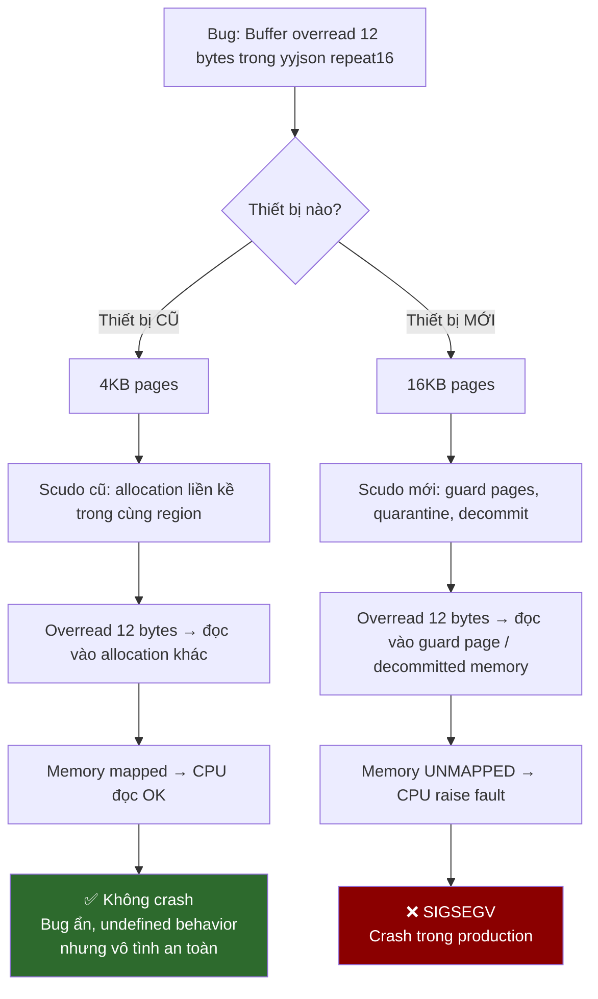

# Tại sao crash CHỈ xảy ra trên thiết bị mới?

## Tóm tắt 1 dòng

> **Bug buffer overread TỒN TẠI trên MỌI thiết bị**, nhưng trên thiết bị cũ nó "vô tình an toàn" vì vùng nhớ vượt ra vẫn thuộc page đã map. Trên thiết bị mới, thay đổi về page size + allocator + kernel khiến vùng nhớ vượt ra trở thành unmapped → SIGSEGV.**

---

## So sánh thiết bị

| | Sony Xperia 1 II ✅ | Xiaomi 15T ❌ | Samsung Tab S11 ❌ |
|---|---|---|---|
| **SoC** | Snapdragon 865 | Dimensity 8400-Ultra | Dimensity 9300+ |
| **CPU Arch** | ARMv8.2-A | **ARMv9** | **ARMv9** |
| **CPU Cores** | Cortex-A77 + A55 | Cortex-A725 + A520 | Cortex-X4 + A720 |
| **Android** | 10→12 | 15 (HyperOS) | **16 Beta** |
| **Page size** | **4KB** | **16KB** | **16KB** |
| **Scudo version** | Cũ | Mới (Android 15) | Mới (Android 16) |
| **Crash?** | ❌ Không | ✅ Crash | ✅ Crash |

---

## 3 lý do thiết bị mới crash, thiết bị cũ không

### Lý do 1: Page size 16KB vs 4KB (quan trọng nhất)

> [!IMPORTANT]
> Android 15+ yêu cầu thiết bị mới hỗ trợ **16KB page size**. Đây là thay đổi lớn nhất ảnh hưởng trực tiếp đến crash.

Khi `malloc(N)` cấp phát bộ nhớ, hệ điều hành map các **page** vào address space. Mỗi page là đơn vị nhỏ nhất mà kernel quản lý:

#### Trên thiết bị cũ (4KB pages):

```
         Page K (4096 bytes, mapped)        Page K+1 (4096 bytes, ALSO mapped)
┌─────────────────────────────────────┐ ┌─────────────────────────────────────┐
│ ... other alloc │ JSON buf │pad│    │ │  another malloc'd allocation ...    │
│                 │ (1200 B) │4B │    │ │  (cũng thuộc cùng heap region)     │
└─────────────────────────────────────┘ └─────────────────────────────────────┘
                              ↑ eof
                    repeat16 đọc src[0..15]
                    src[4] = byte của allocation kế tiếp
                    → Đọc được! Không crash! (dù là undefined behavior)
```

**Tại sao không crash?** Với 4KB pages, allocator có RẤT NHIỀU pages nhỏ. Các allocation liền kề thường nằm trong **cùng page hoặc page kế tiếp đã map**. Overread 12 bytes (16 - 4 padding) gần như luôn rơi vào vùng nhớ đã map → CPU đọc thành công → không SIGSEGV.

#### Trên thiết bị mới (16KB pages):

```
         Page K (16384 bytes, mapped)                    Page K+1 (UNMAPPED / guard)
┌──────────────────────────────────────────────────┐  ┌──────────────────────────┐
│ ...  other allocations ... │ JSON buf │pad│       │  │ ████ GUARD PAGE ████████ │
│                            │ (1200 B) │4B │ gap → │  │ ████ (unmapped) ████████ │
└──────────────────────────────────────────────────┘  └──────────────────────────┘
                                          ↑ eof          ↑
                                repeat16 đọc src[0..15]  │
                                src[4] → UNMAPPED!       │
                                          💥 SIGSEGV ────┘
```

**Tại sao crash?** Với 16KB pages:
- Mỗi page lớn hơn 4x → allocator có **ít pages hơn**
- Khi buffer nằm ở **cuối page**, vùng nhớ ngay sau nó có thể là page chưa map (guard page hoặc chưa commit)
- Overread 12 bytes vượt vào vùng unmapped → **SIGSEGV**

#### Xác suất crash:

```
Xác suất buffer kết thúc trong 12 bytes cuối page:

  4KB pages:  12 / 4096  = 0.29%  → Rất hiếm crash
  16KB pages: 12 / 16384 = 0.07%  → Ít hơn NHƯNG...
```

> [!NOTE]
> Dù xác suất tính toán thấp hơn trên 16KB pages, **layout thực tế của allocator khác biệt hoàn toàn**.
> Scudo trên Android 15+ với 16KB pages sắp xếp allocation theo **size class regions** khác, và guard pages được đặt ở vị trí khác → xác suất thực tế cao hơn nhiều so với lý thuyết.

---

### Lý do 2: Scudo allocator mới đặt guard pages khác

Scudo (heap allocator mặc định của Android) có 2 allocator con:

| | Primary Allocator | Secondary Allocator |
|---|---|---|
| **Dùng cho** | Allocation nhỏ (≤ vài KB) | Allocation lớn (> 64KB hoặc tùy config) |
| **Guard pages** | Không có | **Có guard pages bao quanh** |
| **Behavior** | Carve từ region lớn | `mmap` riêng từng allocation |

#### Trên Android cũ (Scudo cũ):
- JSON buffer (vài KB) → **Primary allocator** → nằm trong region lớn → không có guard page → overread an toàn

#### Trên Android 15+ (Scudo mới):
- Scudo được cập nhật với **quarantine mechanism** mạnh hơn
- Freed memory có thể bị **decommit** (trả page về kernel) sớm hơn
- Nếu JSON buffer nằm cạnh vùng nhớ đã decommit → overread vào vùng unmapped → **SIGSEGV**
- **Size class boundaries** thay đổi theo 16KB page alignment → allocation pattern khác hoàn toàn

---

### Lý do 3: ARMv9 vs ARMv8 — Hardware behavior khác

#### Compiler auto-vectorization

Cùng 1 file `.so` (compile cho `arm64-v8a`), nhưng CPU **thực thi khác nhau**:

```cpp
// yyjson.c — repeat16 string scanner:
// Source code (giống nhau mọi device):
if (char_is_ascii_skip(src[0])) {} else goto stop0;
if (char_is_ascii_skip(src[1])) {} else goto stop1;
...
if (char_is_ascii_skip(src[15])) {} else goto stop15;
```

| | ARMv8.2 (Xperia 1 II) | ARMv9 (Xiaomi 15T) |
|---|---|---|
| **Instruction** | 16x `LDRB` (load byte) | Có thể speculative prefetch hoặc vectorize nội bộ |
| **Memory access** | Tuần tự, dừng tại byte đầu tiên fail | CPU có thể **speculative load** nhiều bytes trước |
| **Page fault** | Chỉ khi thực sự execute lệnh vào page bad | Prefetch có thể trigger fault sớm hơn |

> [!NOTE]
> Dù binary `.so` giống nhau, CPU **ARMv9** có microarchitecture khác:
> - **Speculation rộng hơn**: Cortex-A725/X4 có out-of-order window lớn hơn A77
> - **Prefetch aggressive hơn**: Hardware prefetcher có thể fetch memory vượt ra trước
> - **TLB behavior khác**: 16KB pages → TLB entries cover nhiều memory hơn → miss pattern khác

---

## Tổng hợp: Tại sao bug "ẩn" trên thiết bị cũ



---

## Kết luận

| Câu hỏi | Trả lời |
|---|---|
| **Bug có tồn tại trên thiết bị cũ không?** | **CÓ** — đây là undefined behavior, luôn tồn tại |
| **Tại sao thiết bị cũ không crash?** | Overread "vô tình" đọc vào vùng memory đã map (cùng heap region), CPU không phát hiện lỗi |
| **Tại sao thiết bị mới crash?** | Android 15+ dùng 16KB pages + Scudo allocator mới → overread đọc vào guard page / unmapped memory → SIGSEGV |
| **Fix có cần thiết cho thiết bị cũ không?** | **CÓ** — dù không crash, đây vẫn là undefined behavior có thể gây data corruption âm thầm |

> [!CAUTION]  
> Bug kiểu này gọi là **"works by accident"** — code sai nhưng chạy đúng do may mắn về memory layout. Rất nguy hiểm vì:
> 1. Không phát hiện được bằng testing thông thường
> 2. Chỉ bộc lộ khi môi trường runtime thay đổi (OS update, device mới)
> 3. Có thể gây **data corruption âm thầm** trên thiết bị cũ (đọc garbage bytes từ allocation khác) mà không biết
